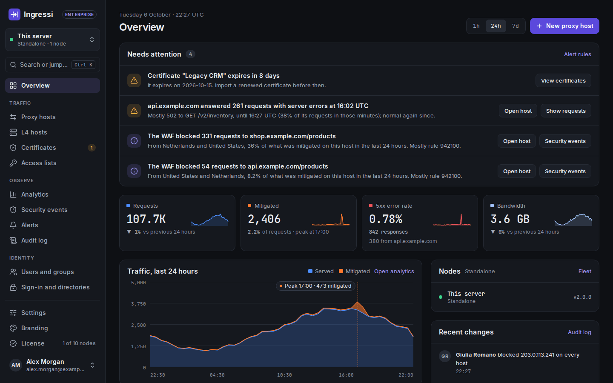

# Ingressi

Reverse proxy and access management for [Caddy](https://caddyserver.com/): a web interface for proxy hosts, certificates, WAF, access control and traffic analytics. Formerly **Caddy Proxy Manager**.

[](#license)
[](https://nextjs.org/)
[](https://www.docker.com/)

[Report a bug](https://github.com/ingres-si/ingressi/issues) • [Request a feature](https://github.com/ingres-si/ingressi/issues) • [Discussions](https://github.com/ingres-si/ingressi/discussions)



## Quick start

```bash
git clone https://github.com/ingres-si/ingressi.git
cd ingressi
cp .env.example .env
# Fill in SESSION_SECRET, ADMIN_PASSWORD and CLICKHOUSE_PASSWORD
# (generate the secrets with: openssl rand -base64 32)
docker compose up -d
```

Sign in at `http://localhost:3000/login` with `ADMIN_USERNAME` (`admin` in `.env.example`) and `ADMIN_PASSWORD`.

Data persists in Docker volumes (caddy-manager-data, caddy-data, caddy-config, caddy-logs, geoip-data, clickhouse-data, acme-ca). The environment variables are listed in the [configuration reference](documentation/configuration.md); before going to production, read [Security](documentation/security.md).

## Upgrading from Caddy Proxy Manager

Caddy Proxy Manager is now Ingressi. Old names keep working, so nothing has to be done; [upgrading-to-ingressi.md](documentation/upgrading-to-ingressi.md) lists every rename. Before any upgrade, read the [upgrade notes](documentation/upgrade-notes.md) of every version since yours, then run `docker compose pull && docker compose up -d`.

## Features

The Community edition (MIT) includes:

- **Proxy hosts:** reverse proxies with custom headers, several upstreams, load balancing (8 policies), active and passive health checks, retries, path-based routes, redirects and rewrites
- **L4 proxy hosts:** TCP/UDP stream proxying with TLS SNI matching, proxy protocol (v1/v2), load balancing, health checks and geo blocking; a sidecar manages the Docker Compose ports
- **Certificates:** automatic HTTPS through ACME (Let's Encrypt, ZeroSSL), DNS-01 with 22 DNS providers, imported certificates, and a built-in CA for client certificates (mTLS) with role-based path rules
- **WAF:** Coraza with the OWASP Core Rule Set, per-host modes, rule exclusions and custom SecLang rules
- **Access control:** access lists (address, country, continent and AS number rules, and basic auth), geo blocking and rate limiting
- **Sign-in:** a built-in forward auth portal with users and groups, Authentik and other forward-auth servers, OAuth2/OIDC sign-in to the dashboard, multi-factor authentication and passkeys
- **Visibility:** traffic analytics in ClickHouse, security events and an audit log of every change
- **Instance sync:** a master pushes its configuration to slaves, with secrets sealed to each slave's own key
- **REST API** under `/api/v1/` with API tokens and an OpenAPI reference at `/api-docs`, and a command palette (Ctrl+K / ⌘K)
- **Dark mode** and a responsive interface for phones

The paid editions (Homelab, Business and Enterprise) add features such as alerting, configuration history, SAML and LDAP sign-in, enforced SSO, SCIM, scheduled backups, fleet management, high availability and white-label branding. Their code lives in `ee/`; [ee/docs/](ee/docs/README.md) describes each feature and the edition that includes it, and [ingres.si/pricing](https://ingres.si/pricing/) has the prices.

## Documentation

- **Installing and running:** [Configuration reference](documentation/configuration.md), [Security](documentation/security.md), [Upgrade notes](documentation/upgrade-notes.md), [Upgrading from Caddy Proxy Manager](documentation/upgrading-to-ingressi.md), [Setup checklist](documentation/setup-checklist.md), [PostgreSQL](documentation/postgresql.md), [Instance sync](documentation/instance-sync.md), [Anonymous usage ping](documentation/usage-ping.md)
- **Dashboard:** [Overview](documentation/overview.md), [Needs attention](documentation/needs-attention.md), [Search and the command palette](documentation/command-palette.md), [Settings](documentation/settings.md), [Profile, sessions and API tokens](documentation/profile.md), [Audit log](documentation/audit-log.md), [Charts](documentation/charts.md)
- **Hosts and certificates:** [Proxy hosts](documentation/proxy-hosts.md), [Proxy host editor](documentation/proxy-host-editor.md), [L4 proxy hosts](documentation/l4-proxy-hosts.md), [Host tags](documentation/host-tags.md), [Certificates](documentation/certificates.md), [Default response](documentation/default-response.md), [Upstream DNS pinning](documentation/upstream-dns-pinning.md)
- **Protection:** [Web application firewall](documentation/waf.md), [Security events](documentation/security-events.md), [Access lists](documentation/access-lists.md), [Geo blocking](documentation/geo-blocking.md), [Rate limiting](documentation/rate-limiting.md)
- **Sign-in and users:** [Forward auth portal](documentation/forward-auth.md), [OAuth and OpenID Connect sign-in](documentation/oauth.md), [Users and groups](documentation/users-and-groups.md), [Sign-in and directories](documentation/sign-in-and-directories.md), [Multi-factor authentication](documentation/mfa.md)
- **Analytics:** [Traffic analytics](documentation/analytics.md)
- **Paid features:** [ee/docs/](ee/docs/README.md)

## PostgreSQL and high availability

- **PostgreSQL:** SQLite is the default; a `postgres://` URL in `DATABASE_URL` runs Ingressi on PostgreSQL, and an existing install can be copied over ([postgresql.md](documentation/postgresql.md)).
- **High availability** (Enterprise): shared certificate storage for Caddy nodes, a dashboard cluster with failover, shared state and PostgreSQL replicas ([high-availability.md](ee/docs/high-availability.md)).

## Security

Report vulnerabilities through [GitHub private vulnerability reporting](https://github.com/ingres-si/ingressi/security/advisories/new), not in a public issue. [SECURITY.md](SECURITY.md) has the disclosure policy and how to verify release images; [documentation/security.md](documentation/security.md) covers running Ingressi in production.

## Contributing

Bugs and feature requests go to [GitHub Issues](https://github.com/ingres-si/ingressi/issues), questions and ideas to [GitHub Discussions](https://github.com/ingres-si/ingressi/discussions). Contributions welcome:

1. Fork the repository
2. Create a feature branch (`git checkout -b feature/name`)
3. Commit changes (`git commit -m 'Add feature'`)
4. Push to branch (`git push origin feature/name`)
5. Open a Pull Request

- Follow the existing code style (TypeScript, Prettier formatting)
- Add tests for new features when applicable. `bun run test:all` runs the typecheck, lint, the PostgreSQL schema check and the unit and integration tests on SQLite and then on PostgreSQL (`TEST_DATABASE_URL`, a disposable server; see `scripts/test-all.sh`). Every test file that uses the database runs on both; `src/lib/db/README.md` explains how
- Update documentation for user-facing changes
- Keep commits focused and write clear commit messages

## License

Everything under the `ee/` directory is source-available under the Elastic License 2.0 - see [ee/LICENSE](ee/LICENSE). All paid functionality lives there. Everything else in this repository is licensed under the MIT License - see the [LICENSE](LICENSE) file.

Next.js only finds pages and API routes under `app/`, so each paid page or route keeps a file there that only re-exports its implementation from `ee/`. These routing files are MIT and contain no paid functionality. [ee/README.md](ee/README.md#where-paid-code-lives) lists every paid feature, its `ee/` module and the files that route to it.

Caddy is a trademark of its respective owner. Ingressi is an independent project and is not affiliated with or endorsed by the Caddy project.

## Acknowledgments

- **[Caddy Server](https://caddyserver.com/)** – The amazing web server that powers this project
- **[Nginx Proxy Manager](https://github.com/NginxProxyManager/nginx-proxy-manager)** – The original project
- **[Next.js](https://nextjs.org/)** – React framework for production
- **[shadcn/ui](https://ui.shadcn.com/)** – Beautifully designed components built on Radix UI and Tailwind CSS
- **[Drizzle ORM](https://orm.drizzle.team/)** – Lightweight SQL migrations and type-safe queries
